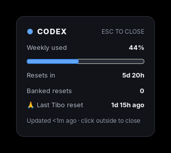
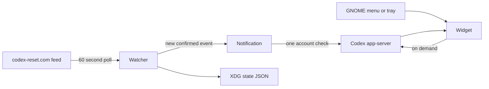

# Codex Reset Widget

A tiny resident Linux utility for monitoring Codex usage and global reset announcements. It stays out of the way in the GNOME status tray, opens as a compact transient card, and surfaces reset notifications without requiring a tracker website to remain open.

<p align="center">
  
</p>

## Features

- Polls a lightweight public reset feed once per minute.
- Detects confirmed Tibo reset announcements without duplicate notifications.
- Reads real account usage from the local Codex app-server on demand.
- Shows weekly usage, the next reset, banked resets, and the latest global reset.
- Distinguishes a global announcement from a reset observed on the local account.
- Lives in the GNOME AppIndicator tray with Open, Check Now, and Quit actions.
- Drag from anywhere except the **PIN** control; pinned mode keeps the widget above other windows.
- Unpinned widgets hide on focus loss; Escape always dismisses and unpins.
- Starts automatically through a systemd user service.
- Stores only minimal local state under the XDG state directory.

## Notifications

<table>
  <tr>
    <td align="center"><strong>Reset announced</strong></td>
    <td align="center"><strong>Account confirmed</strong></td>
  </tr>
  <tr>
    <td></td>
    <td></td>
  </tr>
</table>

The indicator remains available in the desktop status area:

<p align="center">
  
</p>

## Requirements

- Linux with Python 3.11 or newer
- GTK 3 and PyGObject
- Ayatana AppIndicator, or GTK StatusIcon as a fallback
- A GNOME AppIndicator/KStatusNotifierItem extension for tray support
- `notify-send` from libnotify
- An installed and authenticated `codex` CLI with app-server support

On Arch-based distributions, the relevant system packages include `python`, `python-gobject`, `gtk3`, `libayatana-appindicator`, and `libnotify`.

## Install

```bash
git clone https://github.com/1RV1NG-Y/codex-reset-widget.git
cd codex-reset-widget
./install-user.sh
```

The installer creates an isolated application environment under `~/.local/share/codex-widget`, installs the GNOME launcher and tray icon, and enables the background user service. The installed application does not depend on the cloned repository afterward.

After installation, search for **Codex Widget** in the GNOME application menu or run:

```bash
codex-widget
```

## Usage

```bash
codex-widget               # open the usage widget
codex-widget --demo-reset  # preview the two-stage reset notification
codex-widget --daemon      # run silently in the background
codex-widget --quit        # stop the resident application
```

The tray menu also provides **Open Codex Widget**, **Check for resets now**, and **Quit Codex Widget**.

Manage automatic startup with:

```bash
systemctl --user status codex-widget.service
systemctl --user restart codex-widget.service
systemctl --user disable --now codex-widget.service
```

## How it works



The global event source and the personal account source intentionally remain separate:

- `https://codex-reset.com/api/feed` answers whether a reset was publicly announced.
- `account/rateLimits/read` on the local Codex app-server answers what the current account actually reports.

## Resource usage

At idle, the resident GTK/Python process measured approximately 67 MB RSS and 0.0% CPU on the development system. Network activity is one small feed request per minute. Codex itself is queried only when the widget opens or a new reset event is detected.

## Development

Run the source tree without installing:

```bash
PYTHONPATH=src python3 -m codex_widget.cli
```

Run the test suite:

```bash
PYTHONPATH=src python3 -m unittest discover -s tests -v
```

## License

MIT
