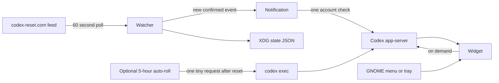

# Codex Reset Widget

A tiny resident Linux utility for monitoring Codex usage and global reset announcements. It stays out of the way in the GNOME status tray, opens as a compact transient card, and surfaces reset notifications without requiring a tracker website to remain open.

<p align="center">
  
</p>

## Features

- Polls the verified reset feed once per minute and fails over to a separate tracker service when the primary is unavailable or malformed.
- Accepts verified archive records when the live feed changes shape, deduplicates events, and never replaces a newer saved reset with older source data.
- Refreshes real account usage every 60 seconds while the widget is visible.
- Shows five-hour and weekly usage with separate reset countdowns, plus banked resets and the latest global reset.
- Optionally keeps the five-hour window rolling with one tiny ephemeral Codex request after each reset; this is off by default.
- Correlates an active Tibo reset signal with a fresh low-usage account observation when the tracker has not confirmed it yet.
- Lives in the GNOME AppIndicator tray with Open, Check Now, and Quit actions.
- Drag from anywhere except the **PIN** control; pinned mode keeps the widget above other windows.
- Unpinned widgets hide on focus loss; Escape always dismisses and unpins.
- Starts automatically through a systemd user service.
- Stores only minimal local state under the XDG state directory.

## Notifications

<table>
  <tr>
    <td align="center"><strong>Reset announced</strong></td>
    <td align="center"><strong>Account confirmed</strong></td>
  </tr>
  <tr>
    <td></td>
    <td></td>
  </tr>
</table>

The indicator remains available in the desktop status area:

<p align="center">
  
</p>

## Requirements

- Linux with Python 3.11 or newer
- GTK 3 and PyGObject
- Ayatana AppIndicator, or GTK StatusIcon as a fallback
- A GNOME AppIndicator/KStatusNotifierItem extension for tray support
- `notify-send` from libnotify
- An installed and authenticated `codex` CLI with app-server support

On Arch-based distributions, the relevant system packages include `python`, `python-gobject`, `gtk3`, `libayatana-appindicator`, and `libnotify`.

## Install

```bash
git clone https://github.com/1RV1NG-Y/codex-reset-widget.git
cd codex-reset-widget
./install-user.sh
```

The installer creates an isolated application environment under `~/.local/share/codex-widget`, installs the GNOME launcher and tray icon, and enables the background user service. The installed application does not depend on the cloned repository afterward.

After installation, search for **Codex Widget** in the GNOME application menu or run:

```bash
codex-widget
```

## Usage

```bash
codex-widget               # open the usage widget
codex-widget --demo-reset  # preview the two-stage reset notification
codex-widget --daemon      # run silently in the background
codex-widget --quit        # stop the resident application
```

The tray menu also provides **Open Codex Widget**, **Check for resets now**, and **Quit Codex Widget**.

### Optional five-hour auto-roll

Use **ENABLE 5H AUTO-ROLL** in the widget to keep a five-hour window active
continuously. The opt-in is persisted across restarts. When enabled, the resident
process reads the current limits and schedules one ephemeral, read-only
`gpt-5.6-luna` request for ten seconds after the active five-hour window resets.
If no five-hour window is active, it starts one immediately.

Each activation consumes a tiny but nonzero amount of weekly usage. The scheduler
pauses at the weekly limit until its reset, retries transient failures after five
minutes, and displays its next action or latest failure directly below the toggle.
Disabling the toggle cancels the pending activation.

Manage automatic startup with:

```bash
systemctl --user status codex-widget.service
systemctl --user restart codex-widget.service
systemctl --user disable --now codex-widget.service
```

## How it works



The global event source and the personal account source intentionally remain separate:

- `https://codex-reset.com/api/feed` answers whether a reset was publicly announced.
- `account/rateLimits/read` on the local Codex app-server answers what the current account actually reports.

## Resource usage

At idle, the resident GTK/Python process measured approximately 67 MB RSS and 0.0% CPU on the development system. Network activity is one small primary reset-feed request per minute, plus one fallback request only when the primary fails. Codex account queries run when the widget opens, once per minute while it remains visible, and once after a new reset event; visible-widget queries stop immediately when the widget hides. If five-hour auto-roll is enabled, the daemon also reads limits to schedule the next activation and sends one tiny Codex request per five-hour window.

## Development

Run the source tree without installing:

```bash
PYTHONPATH=src python3 -m codex_widget.cli
```

Run the test suite:

```bash
PYTHONPATH=src python3 -m unittest discover -s tests -v
```

## License

MIT
